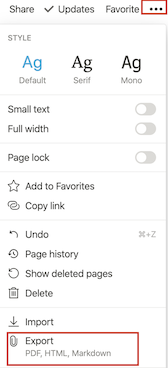

# Notion To Github page

# 1. 들어가기

- Jekyll을 사용하여 깃허브페이지를 만들었는데, 이 마크다운 편집이라는게 글 위주로 작성하는 포스트의경우에는 어떤 편집기를 사용해도 괜찮았으나, **이미지가 들어가는 포스트**를 작성할때에는 경로문제때문에 약간 불편함이있었다.
- 그래서 이미지를 쉽게 삽입하고 Md파일+이미지를 쉽게 익스포트 할수있는 **노션(Notion)**을 주로 사용해보고자하였는데, 이 역시 마냥 편한건아니었다.

---

{: .align-center}


노션페이지에서 옵션을 누르면 Markdown 포맷으로 익스포트가 가능하다. 

{: .align-center}

- 익스포트시 압축파일형태로 파일을 얻을수있는데, 이 압축파일을 열어보면 md파일과 포스트에 쓰였던 이미지등의 리소스파일이 md파일과 동일한 이름의 폴더안에 들어있다.
- md파일에서의 이미지는 이 폴더경로로 연결되어있다.
- 깃허브페이지를 Jekyll로 사용하고있다면 리소스는 assets폴더쪽에 위치시킨후 이미지 경로도 이 assets폴더를 기준으로 적어줘야한다. 따라서 이부분에 대한 수정이 필요하다.
- 노션에서 생성한 md파일에는 frontmatter가 포함되어있지않다. 따라서 이부분도 수동으로 넣어줘야한다.

---

- ***요약하면 노션에서 페이지를 익스포트하면 다음과같은 처리가 필요하다.***
    1. export 된 파일 압축해제
    2. 리소스파일들을 블로그폴더내 assets 하위폴더로 옮긴다.
    3. md파일내 이미지경로를 2번에서의 하위폴더경로로 바꿔준다.
    4. md파일시작부분에 Front Matter를 넣어준다. 
    5. md파일을 블로그폴더로 옮긴다. 

---

- 생각보다 많은 과정이 필요하다. 게으른관계로 블로그도 꾸준히 올리지않는지라 매번 다시 체크해야할게 많다.
- 결국 이러한 귀찮음이 블로그포스팅을 늦추게하는 원인이 되는것같다.
- 그래서 이를 **자동화**하기로했다.

# 2. Notion File to Github Page 자동화

- 구글 검색을 해보니 이를 미리 작업해두신분이있었다.

  uoneway님 깃허브 프로젝트 링크: [uoneway/Notion-to-GitHub-Pages](https://github.com/uoneway/Notion-to-GitHub-Pages)

- 이걸 사용해보려고했는데 shell script로 만들어진것으로 내가 수정해서 사용하기에는 좀 어려움이있었다.(shell script를 잘몰라서 찾아보기 귀찮음..)
- 그래서 어떤걸 처리했는지만 이해하고 비슷하게 파이썬으로 구현해보았다.

---

***구현한 파이썬 프로젝트***

-***깃허브 프로젝트 링크***: [RyoniCho/NotionToGithubPage](https://github.com/RyoniCho/NotionToGithubPage)

- 구현해놓은건 심플하다. (그냥 수동으로 하던걸 자동화한거니까.)
    1. 타이틀-시간정보는 input으로 받는다.
    2. 압축파일을 푼다.
    3. md파일을 읽어서 이미지경로를 assets하위 폴더로 바꿔준다.
    4. 이미지파일들은 하위경로로 옮겨준다. 
    5. Front matter는 txt파일에서 가져온다. 
    6. 수정된 내용을 바탕으로 새로운 md파일을 만든다. 
    7. 끝

# 3. 사용방법

1. notionToGithubPage.py파일과 customFrontMatter.txt파일을 블로그폴더에 둔다.
2. 노션에서 익스포트한 압축파일을 블로그폴더로 옮긴다.
3. customFrontMatter을 열어 frontmatter내용을 적는다(타이틀과 날짜는 제외)
4. 터미널에서 블로그폴더로 이동한다음 파이썬파일을 실행한다. 

    ```bash
    Python3 notionToGithubPage.py

    ```

5. 날짜정보와 타이틀 정보를 적는다.
6. 새로 생성된 md파일을 포스트폴더로 옮긴다.(이미지파일등은 assets폴더쪽으로 이동됨)
7. 끝