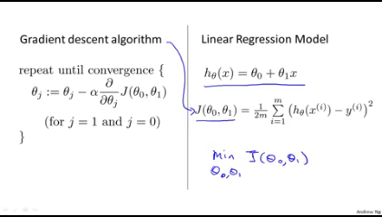
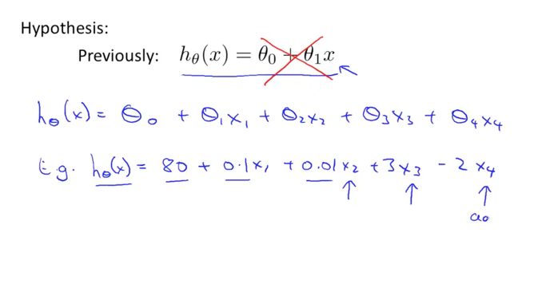
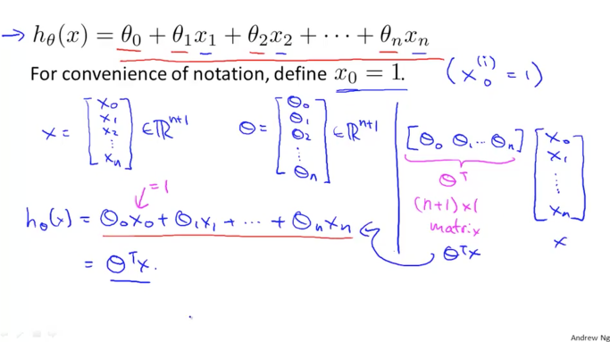
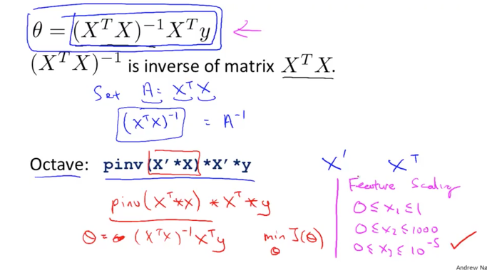
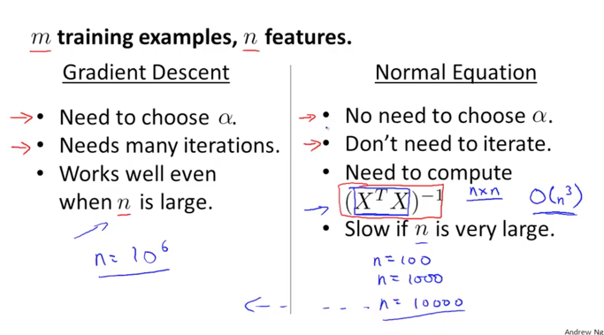

# [ML] Linear Regression

## Linear Regression (One Variable)

집크기와 집가격에 대한 데이터셋이 있다고 하자. 

---

---

- i=1일때 집사이즈(x1)는 2104. 집가격(y1)은 460이다.
- 이러한 값들을 그래프에 찍어보면 아래와같은 추세로 나타난다.
- 집사이즈가 커질수록 집크기가 커지고있으니 이를 나타낼수있는 선을 그어보면 핑크색 선처럼 보일것이다.
- 이 직선은 집사이즈와 집가격에대한 상관관계를 잘 나타내주는 그래프이면서 일차방정식으로 표현이 될수있다.

- 이 직선은 우리가 아는 일차방정식이자 일차함수와 같이 나타낼수있으며, 이를 우리는 중학교 수학과정에서 이렇게 배워왔다. (a는 직선의 기울기 b는 y절편. )

---

$$y=ax+b$$

---

- 이 직선의 기울기와 y절편을 구해서 식을 도출할수있으면, x만 주어지면(즉 집사이즈만 주어지면) y를(즉 집가격을) 구할수 있게된다.
- 즉 예측이 가능해진다. 이 직선을 어떻게 도출하는걸까?
- 이 직선을 도출하는것을 우리가 계산해서 하는게 아니라, **알고리즘을 통해 컴퓨터가 학습하여  찾아내게 하는것이 머신러닝의 출발점**이다.

---

- 앤드류 응 교수의 머신러닝 강의에서는 우리가 알고있는 이 일차함수, 일차방정식을 다음과 같이  나타내고있다. (표기방식만 다를 뿐 같은이야기다.)
- h는 Hypothesis. 즉 가설을 의미하고, a,b를 theta로 나타내고있다. 즉 우리는 컴퓨터가 이 theta를  찾게하는것이 목표이다.

---

$$h_\theta(x)=\theta_0+\theta_1*x$$

---

⇒어떻게 theta를 찾을수있을까. ( How To Choose theta?)

---

## Cost Function

- 우리는 이미 결과값을 알고있기때문에 실제결과 값과 알고리즘이 수행한 예측값을 비교해서 그 차이를 구할수있다. 그 차이(Cost)가 가장 작을수있는 theta값을 구하는것이 목적이된다.
- 실제결과값과 알고리즘이 수행한 예측값의 차이. 즉 Cost는 다음과 같이 나타낼수있다.

---

$$Cost^i= h_\theta(x^i)-y^i$$

---

- 쉽게생각해서 i가 1일때 Cost는 다음과같다. (x1은 2104, y1은 460)

---

 

$$Cost^1=h_\theta(x^1)-y^1\\=h_\theta(2104)-460
$$

---

- 이렇게 구하는 cost를 모든 데이터셋의 상황에 대해 cost를 구하고 이를 다 더하면 총 cost를 구할수있다.
- 즉 이러한 식으로 나타낼수있다.

---

$$\sum_{i=1}^m(Cost^i)^2=\sum_{i=1}^m (h_\theta(x^i)-y^i)^2$$

---

- m은 데이터셋의 갯수를 의미하며, 기존 cost식을 제곱한 이유는 cost 값이 음수(마이너스)가 될수있기때문에 이를 제곱하여 항상 양수가 되게 해준것이다. 이 총 cost의 합을 2m으로 나눠주면 평균값이 되는데, 머신러닝에서는 이 평균값을 최소화하는게 목표가 된다.

- 즉 이 모든것들을 종합해서 식으로 나타내면 다음과 같다.

---

$$minimize\ \ \  J(\theta_0,\theta_1)={1\over2m}\left(\sum_{i=1}^m (h_\theta(x^i)-y^i)^2\right)$$

---

- 식은 도출했는데, 그래서 저걸 어떻게 최소화해야하는걸까?
- 최소화방법을 소개하기전에 이 종합적인 Cost함수가 무엇을 의미하는지 알아보자.

- 지금까지 나온식들을 정리해보면 다음과같은데 theta 0 (즉 y절편)을 0이라고 생각하면 식이 좀 간단해진다. (Simplified). 이렇게되면 원점을 통과하는 직선의 방정식이 된다.
- 즉, y=AX가 되는것이다. (오른쪽)

- 이때 이 기울기인 theta1이 1이라고 가정해보자. 즉 y=x가 된다.
- 우리가 예측한 함수가 y=x일때 실제 데이터셋도 (1,1),(2,2),(3,3)이었다고 가정해보자.
- (즉 완벽하게 실제값을 예측)

- 그렇게되면 왼쪽 그래프의 직선(예측함수의 그래프)과 실제데이터(x로 표시된부분)이 일치하게된다.
- 이를 cost함수에 넣어서 오른쪽 그래프처럼 theta 1의 값에 따르는 J(theta1)의 그래프로 나타내면 theta가 1일때의 J(비용)은 0이된다.

- 이를 theta1 값을 달리하면서 찍어보면 이렇게 2차함수 모양이 된다.
- 즉 우리는 이 이차함수에서 y값인 비용을 가장 줄이는 꼭지점의 theta1을 찾아야하는것이다.

- theta0 과 theta1을 동시에 비용함수와 함께 나타내면 3차원그래프가 된다. (아래그래프)

- 이 3차원 그래프를 등고선 형태로 나타내면 다음과 같이 나타낼수있다.

- 위의 그래프와같이(왼쪽) theta 0과 theta1을 가지는 h함수를 발견했다면 등고선의 중점과 먼곳을 알수있다. J의 중앙에서 멀게되는것이 비용이 높게되는것이다.

- 이렇게 우리는 이 비용함수의 최저점. 등고선의 중점이 되는곳을 찾아야한다. (학습을 통해)

---

## Gradient Descent Algorithm

- 번역하면  경사하강알고리즘이라고하는 이 알고리즘은,  Cost함수를 minmize하는 대표적인 알고리즘이다.
- 다양한 분야에서 범용적으로 사용되고있는 알고리즘인데, 3차원으로 비용함수를 그려보면, 이 알고리즘을 직관적으로 이해할수있다.

- 이제까지의 배운것을 요약하면 다음과같다. 비용함수를 도출해서 이를 최소화하는 theta값을 구해야하는데, 이를위해 어느 theta값으로 시작해서 theta값을 조금씩 바꿔가면서 비용값을 줄여나간다.
- 이 줄여가는걸 반복해서 최소점에 도달하면되는것이다.

- 3차원 그래프로 이를 나타나면 빨간색의 어느점을 선택해서 경사면을 따라 하강하여  최저점인 파란색점에 도달하는것이다. 이를 위해서 구체적으로 어떻게 해야할까.

---

- 다시 theta1 과 이에대한 비용함수를 그린 2차함수로 생각해보자.
- 우리가 theta1을 핑크색점으로 일단 시작했다고해보자. 이때의 J(theta1)은 높은편이다.
- 이를 줄이기위해서는 (그래프상으로는) theta1의 값이 줄어들어야한다.

---

- 이차함수의 최저점은 우리가 알다시피 꼭지점이다. 그 꼭지점과 맞닿는 접선의 기울기는 몇일까?
- 고등학교나 대학교때 배운 미분이나 물리시간에 배운 순간가속도내용을 떠올려보자.  이때의 접선의 기울기는 0인데, 이 접선의 기울기는 해당함수를 미분한값이다.

---

- 즉 우리는 이 접선의 기울기가 0에 가까운순간으로 theta값을 바꿔가면 된다.
- 이를 위해 기존 theta값에다가 그 theta값의 접선의 기울기, 즉 비용함수를 미분한 값을 빼서  다시 theta값에치환해준다.
- 그런식으로 반복하다보면 핑크색점에서 녹색점으로 빨간점으로 점점 theta값이 감소해가면서 접선의 기울기는 0에가까워져갈것이다.

---

- 왜 미분한값을 빼주는가에 대한 의문이있을수있다.  이 의문에 대해서는 다음과 같이 설명할수있다.

- 접선의 기울기, 즉 미분(정확히는 편미분)을 한값이 양수일경우에는  기존 theta에서 미분한값을 빼주면 theta가 작아지면서 왼쪽을 이동한다.
- 아래 그래프는 미분값인 접선의 기울기가 음수인경우인데 이 경우에는 빼주는값이 음수가 되어 theta는 커지게되고 오른쪽으로 이동한다.
- 어느쪽이든 반복에따라 최소값을향해 움직이게된다.

---

- 이제 이를 식으로 정리해보자.
- theta0,theta1 모두 이런식으로 미분한값을 계속 빼주는방식으로  값을 구하는것이 gradient descent라고 할수있다.

---

$$ repeat\ until\ convergence \{\ \ \  \theta_j:=\theta_j-\alpha {\partial \ \over \partial\theta_j}J(\theta_0,\theta_1) \ \ \ \ \ for(j=0\ and\  j=1)\}$$

---

- := 의 의미는 오른쪽 항을 왼쪽항에 치환한다는 의미이다. 결국 기존 theta 0 에 theta 0로 비용함수를 편미분한 값을 빼서 기존 theta0을 해당값으로 바꿔준다. theta1도 동일하게 진행한다. 이를 세트로 반복하는것이다.

- 여기에서 alpha값은 learning rate로 경사면을 내려올때 어느힘으로 내려오는지에 대한 값이다. 이 값이 커지면 빠르게 내려올것이고 작으면 느리게 내려올것이다.
- alpha 뒤에는 비용함수를 편미분한다는것을 알수있다. theta0로 미분할때는 theta0을 제외한 다른 변수들은 상수취급한다고 생각하면된다.

- 이렇게 각각의 theta값에서 각 theta로 비용함수(J)를 미분한것을 빼주고 이를 원래 theta에 반영해준다. 이때원래 theta에 대입해주는것은 왼쪽(Correct: Simultaneouse update)처럼 한꺼번에 각각 theta에 반영해주어야한다. 오른쪽처럼 반영한다면 theta0가 바뀐 J를 가지고 theta1을 계산하기때문에 엉뚱한 계산이 될수있다.
- 이런식으로 최적 theta를 찾아낸다면 적절하게 학습을 한것이라고 볼수있다. 지금까지의 내용을 정리해보면 다음과 같이 나타낼수있다.

    

---

## Linear Regression With Multiple Variables

- 지금까지 살펴본 선형회귀문제는 x의 값이 한개인 단일문제의 경우였다. 그렇다면 이러한 x값이 많아진다면 어떤식으로 해결해야할까?
- 위의 문제에서는 집가격(Y)과 집크기(X)의 상관관계만 존재했지만, 현실에서는 이 외에도 많은 고려사항이있을수있다. 침실의 갯수(X2),집의 층계(X3),집 노후정도(X4)등. X한개가 아닌 여러 변수들이 존재할수있는것이다.
- X 단일이 아닌 X1,X2,X3,X4..로 X를 늘리게 된다면 기존의 공식은 다음과 같이 바뀌게된다.

- 이 X의 갯수가 많아짐에 따라 theta의 값도 같이 많아지게된다. X0를 1이라고 가정하면(상수인 theta 0에 곱해지는) X0부터 Xn까지 X가 있다고 가정하면, theta도 theta0부터 thetaN까지 있게된다. (이렇게 되면 0부터 시작해서 n까지 있으므로 x와 theta는 각각 n+1개가 있다)
- 이 많은수를 우리는 쉽게  Matrix(행렬)로 나타낼수있다. X matrix는 x0~xn까지, Theta Matrix는 theta0~theta N으로 나타내는것이다. 이를 원래 식처럼 theta 곱하기 X로 나타내기위해서는 행렬의 곱셈연산이 되려면 앞 행렬의 열갯수와 뒤 행렬의 행갯수가 같아야하므로, theta를 전치행렬(transpose)해서 곱해준다.

    

- 이런식으로 식을 바꾸게되면 결국 우리가 이전에 했던 식과 동일한 형태가 된다.

---

$$h_\theta(x_0,x_1...x_n)=\theta_0x_0+\theta_1x_1+....\theta_nx_n$$

$$
h_\theta(X)=\theta^TX$$

---

- 그렇다면 Gradient Decent는 어떻게 될까. 이 역시 Matrix로 바꿔주면 식이 심플해진다. 결국 이전과 동일하게 진행을 할수있을것이다.

    

    

    - 이와같이, theta matrix로 한번에 표현이 되게된다
    - n이 1개(왼쪽)일때와 1보다 많아질때(오른쪽)를 비교해보자. 결국 같은식이 된다.
    - 결국 feature가 늘어나더라도 같은식이 되며 표현이 심플해진다.

    ---

    ## Gradient Descent 를 사용할때 주의해야할 점.

    - 이 알고리즘을 사용함에 있어서 몇가지 주의해야할 점이 있다.

    1. Feature Scaling
        - 각각의 feature들은 제각기 다른 정보를 나타내는것이기때문에 그 정보의 단위가 다를수있다. 1000단위로 나타내는 정보도있을수있고 0.01~0.05등 작은 단위로 나타내는 정보가있을수있다. 예를들어 집의 층계수는 1-10정도의 단위이겠지만, 집가격은 억단위숫자일수있다.

            

        - 이러한 데이터를 그대로 사용한다면 feature단위에 따라 등고선형태가 홀쭉하거나 뚱뚱하게 나타낼수있다. 그렇게되면 알고리즘이 목표로 하는 중앙의 점을 찾는데 오래걸릴수가있다. (왼쪽)그렇기에 같은 scale로 feature를 맞춰주는것이 효율적으로 알고리즘을 동작하게 하는방식일것이다.(오른쪽)
        - 적절한 Scale을 만드는 법(Mean Normalization): 해당 feature 값의 평균값을 구해서 해당 feature에서 이 평균값을 뺀후 해당feature의 최고값과 최저값의 차(range)로 나눠서  구한다.

    2. Learning Rate 
        - Gradient descent 알고리즘에서의 alpha값을 우리는 learning rate라고 배운바있다. 이 값이 커지면 하강속도가 빨라지며 작으면 하강속도가 느려지는 값이다.

            

        - 이 값은 Hyper parameter로 불리는 값으로 학습할때 적절한값으로 넣어주어야하는 값인데 이 값이 너무 커지게되면 최적점을 찾지못하고 상승하락을 반복할수있다. 그리고 그 반대로 값이 너무 작게되면 학습속도가 너무 느려지는 문제가있다. 그래서 이 값은 너무 작아도 너무 커도안되는값으로 적절한 값으로 조절하는것이 필요하다.
        - 오른쪽 그래프의 경우 알파값이 너무커서 최적점을 찾지 못하는경우이다.

        ---

        ## Linear Regression을 처리하는 다른방법: Normal Equation

        - Gradient Descent를 사용하지않고 최적점을 구하는 다른방법이 존재한다.
        - 바로 수학적으로 답을 구하는것이다. 우리는 비용함수를 미분하여 최적의 theta값을 찾아가는 알고리즘을 사용하고있지만, 수학적으로 최적점을 구하는것은 매우 간단하다. 이차함수그래프에서 최소점으 어디인가. 바로 꼭지점이다. 이때의 접선의 기울기는 0이다. 즉 비용함수를 미분했을때의 값이 0이되는 theta값을 구하면 된다.

            

        - 이 값은 위와같은 식이된다. 이것은 복잡한 계산으로 손으로 할 필요는 없다. 프로그램을 이용하면 쉽게 풀수있는 문제이다.
        - 이러한 식으로 theta값을 구하는 경우에는  gradient descent처럼 feature를 scale할 필요는 없다. 어차피 수학적으로 한번에 값을 구하기 때문이다. 또한 learning rate인 alpha값을 설정할 필요도없다.
        - 다만 이 방법을 사용하기위해서는 XtX의 inverse계산을 수행해야한다는 단점이있다. 이 계산은 X matrix의 크기에따라 성능한계가있다. x의 갯수가 많을수록 이 계산을 모두 수행해야하는 단점이 있는것이다. 따라서 학습데이터가 많지않을경우에 사용하는것이 권장되는 방법이다.

            

        - 두개의 알고리즘을 비교하면 위와 같다.