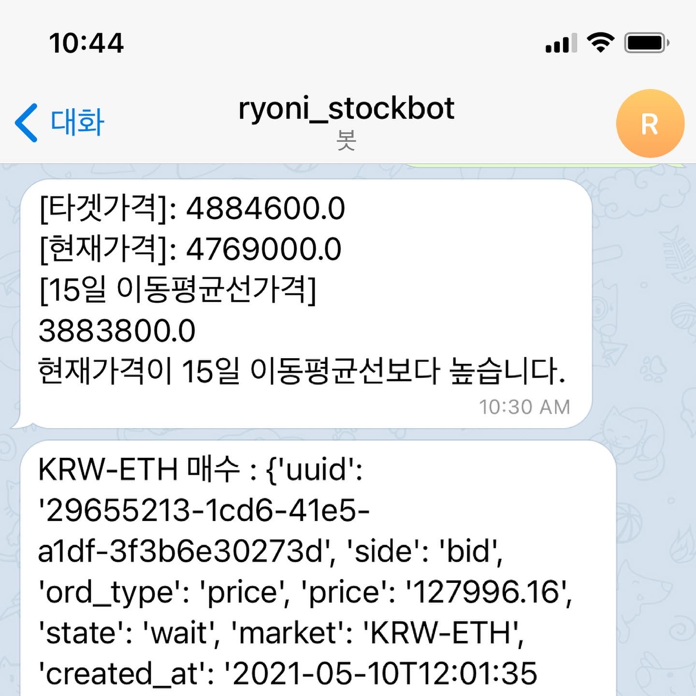

# 비트코인 자동투자봇 만들기

## Python Small Project( 업비트 API / 텔레그램봇 사용)

### 1. 블록체인? 게임은 아니라서 관심은 없었지만..

블록체인 기술을 활용한 비트코인은 지난 몇년간 핫한 이슈중 하나였다. 핫한기술이긴한데 귀찮기도하고
게임이랑은 연관성이 없다보니 그냥 그런게 있구나 정도만 염두하고 관심을 꺼두고살아왔다. 근데 주식도 하면서
재테크를 생각하다보니 비트코인을 비롯한 코인들의 변동성이 상당하다는걸 알게되었다. 더구나 거래시에 수수료를
제외하면 세금도 아직없는데 지금이 투자봇을 만들어서 테스트할 절호의 기회는 아닐까?

### 2. 개발자 유튜버의 쉽고빠른 영상을 접하다.

그러나 나처럼 게으른 개발자에게 퇴근후에 뭔가를 꾸역꾸역만든다는건 여간 쉬운일이 아니다. 만드는건 어렵지않겠지만
일단 시작하는게 어마어마한 의지가필요하다는것. 작은 게임프로젝트라면 재미있어서 시작하는게 그래도 수월했지만 이런 프로젝트는 시작하는게 너무 어렵다. 그러던와중 유명 개발자 유튜버 조코딩님이 아주 쉽게 비트코인 자동투자봇을 만든걸 올려놓은걸 접했다. 변동성돌파 전략으로 upbit api를 활용하여 만든 봇이었는데 요거 그냥 가져다 써도 금방 만들수있겠다 싶었다.
그래서 그냥 가져다가 내입맛대로 바꿔서 돌려버림.

### 3. 기본골격은 그대로(복 to the 붙): 변동성돌파전략 

기본적인 골격은 동일하게 하였다. 자동거래봇의 골자는 변동성돌파전락을 사용한다는것. 전날의 변동성을 고려하여 오늘의 타겟가격을 정하는게 이 전략의 핵심이다. 코인류는 24시간 거래가 이루어지기때문에 장마감이라는것자체가없다. 그래서 오전 9시를 기준으로 거래소의 하루가 변하고있다. 따라서 8시 59분에 그날 매수한 코인은 모두 매도하고 변동성돌파전략에 따라 설정한 타겟가격이 되는순간 전략 시장가로 매수한다. 이 타겟가격은 전날 시가와 고가의 변동성에 적절한 K값을 넣어서 만든 변화량을 전날 종가, 즉 오늘 시가에서 변화량을 더해서 만든다. 이렇게되면 전날 변동성변화량보다 더 가격이 높아져야 매수가되는데 이때는거의 상승장이라고 볼수있다. 이 타겟가격보다 낮은가격을 형성하면 상승장이라고 볼수없고 하락하는것이라고 볼수도있기에 매수하지않는다. 

### 4. 수정한부분

봇이 돌아가는건 동일하게 작성하였고, 함수 인자로 코인을 바꿀수있게 수정을 하였다.(해당강의를 보면 알겠지만 비트코인을 메인으로 하고있다.) 그리고 슬랙봇을 이용해 노티를 하고있는데, 나는 회사에서 슬랙을 사용중이라서 왠지 노티가 헷갈릴수있어 텔레그램봇을 활용하였다. 그리고 중간중간 타겟가격/K값들이 궁금할것같아 텔레그램봇을 활용해 이를 물어볼수있게 해두었다. K값은 0.5로 기본설정되어있는데 7일치 Best K값을 매일 구해서 K값을 수정하는 방식을 한번사용해보았다. K갱신이라고 텔레그램에서 입력하면 봇이 이를 받아들여 K값을 다시 갱신한다. 

### 5. 그래서 결과는?

여기까지보면 알겠지만, 뭐 바꾼것도 없고 그냥 있는코드 잘써먹은거다. 나는 비트코인대신 이더리움을 사용했는데 일주일정도 돌려봤더니 이더리움이 운좋게도 상승장이여서였는지 누적수익룰 30%를 기록했다. 테스트삼아 10만원만 넣었는데 좀 더넣을걸그랬나.... 암튼 내가 뭘 열심히 만든건 아니지만 (거의 복붙만 한것같지만) 재밌는 프로젝트였다. 관심있는 사람은 조코딩님 유튜브를 보고 만들어보는것도 괜찮을듯. (깃허브로 코드도 공개해서 만들기 개편하다.) 그리고 업비트 api도 생각보다 잘되어있어서 너무 편했다. 증권사 api가 윈도우 32비트에서만 돌아가는 거지같은 상황임을 고려하면 아주아주 쾌적한 환경을 제공한다. 

> 텔레그램봇. 현재상황도 알려준다. 

{: .align-center}

> 수익률이 마이너스일때도 있지만 누적수익률은 꽤좋다.

{: .align-center}

### 6. 참고자료

- 조코딩님 깃허브 프로젝트 링크: [JoCodingGithub](https://github.com/youtube-jocoding/pyupbit-autotrade)
- 조코딩님 유튜브 링크: [JoCodingYoutube](https://youtube.com/playlist?list=PLU9-uwewPMe3KKFMiIm41D5Nzx_fx2PUJ)
- 비트코인트레이딩봇 수정한 내 버전 링크:[BitcoinAutoTrade](https://github.com/RyoniCho/BitcoinAutoTrader)

