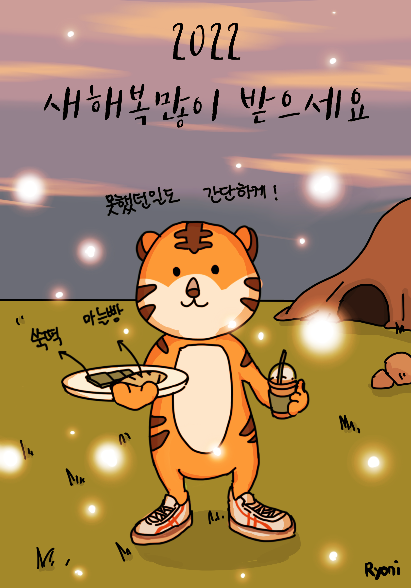

### 마늘과 쑥을 쌩으로 못먹었을뿐인 호랑이해를 맞이하여 

***

- 프로크리에이트로 작업
- 부모님들이 새해맞이로 카드를 주고받는걸보고 급히 그려봤다. 
- 호랑이 하면 떠오르는건 단군신화. 사실 곰부족의 후예라고하면서 호랑이를 한국대표동물로 꼽는것도 좀 이상한일이기도 하다. 

요새는 처음부터 끝까지 내 상상만으로 그림을 그리는일이 부쩍줄었다. 그림에대한 자신감도 없어졌고,실력은 없는데 내 눈은 올라가있는상태라서 쉽게 
내그림에 내가 만족할수없는상태라서 그런것같다. 그래도 이건 부담감없이 바로 그린거라 기분은 좋게그렸던것같다.
2022년에는 이렇게 어떤일을해도 어렵게 생각하지않고 수월하게 흘러갔으면 좋겠다. 
